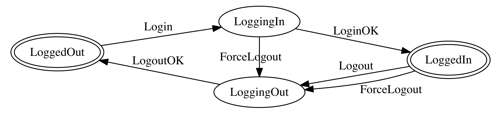

# RxAutomaton

[RxSwift](https://github.com/ReactiveX/RxSwift) port of [ReactiveAutomaton](https://github.com/inamiy/ReactiveAutomaton) (State Machine).

>
> ### Terminology
>
> Whenever the word "signal" or "(signal) producer" appears (derived from [ReactiveCocoa](https://github.com/ReactiveCocoa/ReactiveCocoa)), they mean "hot-observable" and "cold-observable".

## Example

(Demo app is bundled in the project)



To make a state transition diagram like above _with additional effects_, follow these steps:

```swift
// 1. Define `State`s and `Input`s.
enum State {
    case loggedOut, loggingIn, loggedIn, loggingOut
}

enum Input {
    case login, loginOK, logout, logoutOK
    case forceLogout
}

// Additional effects (`Observable`s) while state-transitioning.
// (NOTE: Use `Observable.empty()` for no effect)
let loginOKProducer = /* show UI, setup DB, request APIs, ..., and send `Input.loginOK` */
let logoutOKProducer = /* show UI, clear cache, cancel APIs, ..., and send `Input.logoutOK` */
let forcelogoutOKProducer = /* do something more special, ..., and send `Input.logoutOK` */

let canForceLogout: State -> Bool = [.loggingIn, .loggedIn].contains

// 2. Setup state-transition mappings.
let mappings: [Automaton<State, Input>.NextMapping] = [

  /*  Input   |   fromState => toState     |      Effect       */
  /* ----------------------------------------------------------*/
    .login    | .loggedOut  => .loggingIn  | loginOKProducer,
    .loginOK  | .loggingIn  => .loggedIn   | .empty(),
    .logout   | .loggedIn   => .loggingOut | logoutOKProducer,
    .logoutOK | .loggingOut => .loggedOut  | .empty(),

    .forceLogout | canForceLogout => .loggingOut | forceLogoutOKProducer
]

// 3. Prepare input pipe for sending `Input` to `Automaton`.
let (inputSignal, inputObserver) = Observable<Input>.pipe()

// 4. Setup `Automaton`.
let automaton = Automaton(
    state: .loggedOut,
    input: inputSignal,
    mapping: reduce(mappings),  // combine mappings using `reduce` helper
    strategy: .latest   // NOTE: `.latest` cancels previous running effect
)

// Observe state-transition replies (`.success` or `.failure`).
automaton.replies.subscribe(next: { reply in
    print("received reply = \(reply)")
})

// Observe current state changes.
automaton.state.asObservable().subscribe(next: { state in
    print("current state = \(state)")
})
```

And let's test!

```swift
let send = inputObserver.onNext

expect(automaton.state.value) == .loggedIn    // already logged in
send(Input.logout)
expect(automaton.state.value) == .loggingOut  // logging out...
// `logoutOKProducer` will automatically send `Input.logoutOK` later
// and transit to `State.loggedOut`.

expect(automaton.state.value) == .loggedOut   // already logged out
send(Input.login)
expect(automaton.state.value) == .loggingIn   // logging in...
// `loginOKProducer` will automatically send `Input.loginOK` later
// and transit to `State.loggedIn`.

// 👨🏽 < But wait, there's more!
// Let's send `Input.forceLogout` immediately after `State.loggingIn`.

send(Input.forceLogout)                       // 💥💣💥
expect(automaton.state.value) == .loggingOut  // logging out...
// `forcelogoutOKProducer` will automatically send `Input.logoutOK` later
// and transit to `State.loggedOut`.
```

## License

[MIT](LICENSE)
